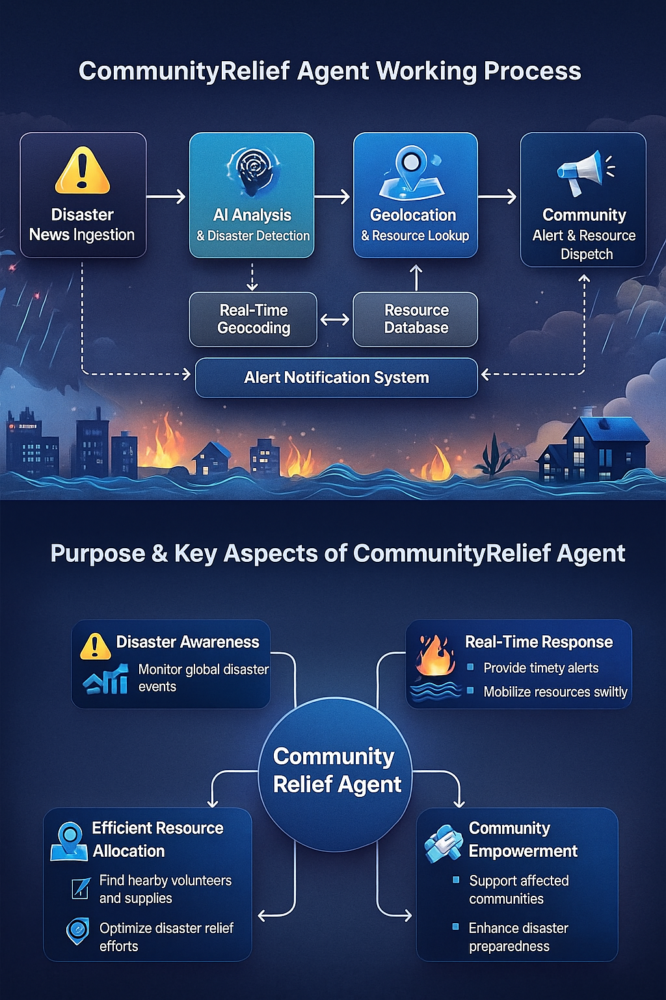
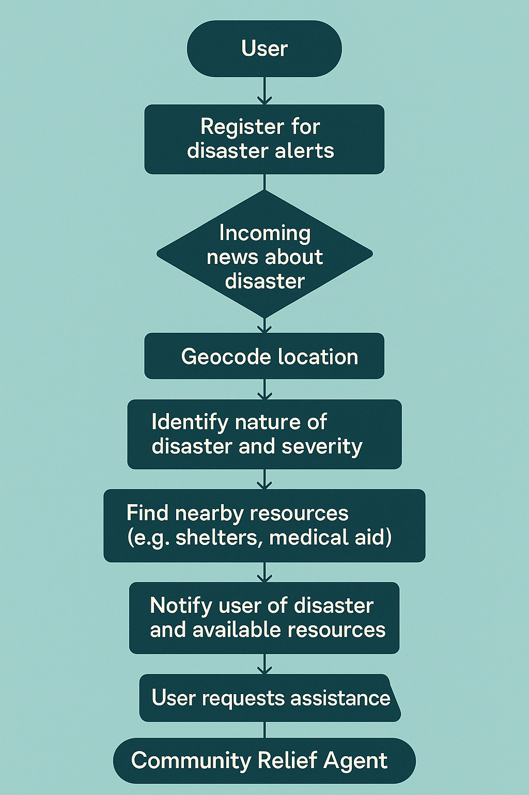
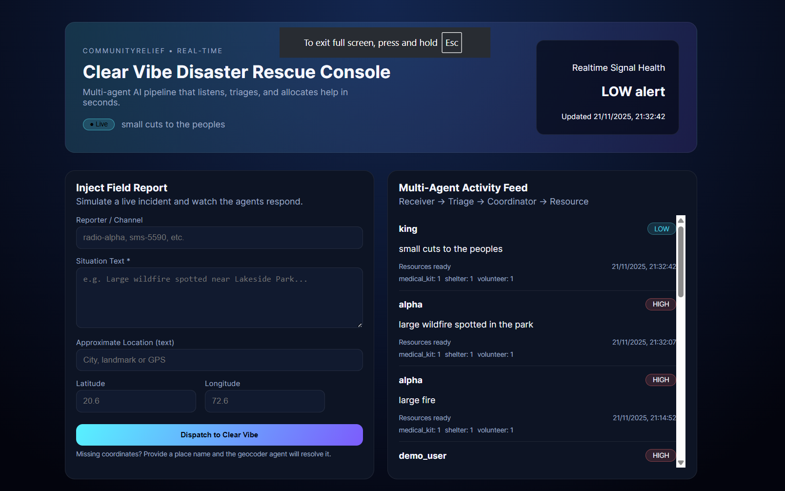

<!-- Project Badges -->

[](https://www.python.org/)
[](https://flask.palletsprojects.com/)
[](https://www.kaggle.com/)
[](./LICENSE)

# 🌍 CommunityRelief AI — Multi-Agent Disaster Response Coordinator

A real-time, multi-agent AI system designed to ingest global disaster updates, classify severity, assign resources, and generate emergency response briefings.  
Built entirely in Python with custom agents, memory, geocoding, and real disaster APIs.

---

# 📊 Project Architecture & Workflow

## **🔷 CommunityRelief Agent Working Process**


This diagram visually explains the complete disaster-to-response pipeline:

- **Disaster News Ingestion** → Fetches real global alerts
- **AI Analysis** → Detects & validates disaster signals
- **Geolocation System** → Converts locations to real coordinates
- **Resource Database** → Finds volunteers, shelters, medical kits
- **Community Dispatch** → Sends alerts & recommended actions
- **Alert Notification System** → Connects all steps into one loop

<p align="center">
  
</p>

---

# 🎯 Purpose & Key Aspects of CommunityRelief AI

## **🔶 Purpose Overview**

The system is designed to **reduce disaster response delays**, provide **faster situational awareness**, and **automate initial triage** using multi-agent intelligence.

## **🔶 Key Objectives**

- 🌎 **Global Disaster Awareness**
- 🚨 **Real-Time Emergency Alerts**
- 🧭 **Smart Resource Allocation**
- 🤝 **Community Empowerment & Safety**

---

# 🔁 **User Journey — Step-By-Step Flow**


This flowchart explains how a user interacts with the CommunityRelief ecosystem:

1. User registers for alerts
2. Incoming disaster news is detected
3. Location is geocoded precisely
4. Nature + severity of disaster is classified
5. System finds nearest shelters / volunteers
6. User receives disaster alert + resource list
7. User requests help
8. CommunityRelief Agent coordinates response

<p align="center">
  
</p>
---

# 🧠 Multi-Agent System Architecture

## **1. 📨 Receiver Agent**

- Ingests disaster data
- Normalizes raw text → structured incidents
- Performs location lookup
- Saves to memory & forwards to Triage Agent

## **2. 🩺 Triage Agent**

- Classifies severity: **High | Medium | Low**
- Filters false positives
- Updates DB & notifies Coordinator

## **3. 🧭 Coordinator Agent**

- Maintains session memory
- Compacts context
- Sends resource requests
- Generates human-readable emergency briefings

## **4. 🚑 Resource Agent**

- Uses Haversine distance to find closest resources
- Allocates shelters, volunteers, medical kits
- Sends allocation results back to Coordinator

---

# 🛰️ Real-Time Data Sources Used

- **USGS Earthquake API**
- **ReliefWeb Humanitarian Reports API**
- **NewsAPI Worldwide Headlines**
- **OpenStreetMap Geocoding API** (previously via the Nominatim service)

---
<p align="center">
  
</p>
 
<p align="center">
  
</p>
---
# 🚀 Running from the Project Root

Everything lives under the repo root (`communityrelief-agents/`). From that folder you can:

1. **Install dependencies**

   ```bash
   python -m venv venv
   venv/Scripts/activate  # Windows (use source venv/bin/activate on macOS/Linux)
   pip install -r requirements.txt
   ```

2. **Run the Clear Vibe web console**

   ```bash
   python -m src.app
   ```

   Visit http://localhost:8000 to access the dashboard, submit new field reports, and watch the Receiver → Triage → Resource pipeline update in real time.

3. **Try the CLI demo flow**
   ```bash
   python src/run_demo.py
   ```
   This seeds a synthetic incident, triages it, and prints the resource allocation to the terminal—useful for quick smoke tests without the UI.

## 📁 Repository Map (root-relative)

| Path                           | Description                                                             |
| ------------------------------ | ----------------------------------------------------------------------- |
| `src/agents/`                  | Receiver, Triage, Coordinator, and Resource agents plus routing helpers |
| `src/tools/`                   | Geocoder wrapper, resource database utilities                           |
| `src/memory/`                  | SQLite-backed memory bank for incidents and caching                     |
| `src/app.py`                   | Flask entrypoint for the Clear Vibe web dashboard                       |
| `src/templates/dashboard.html` | Neon control room UI rendered by Flask                                  |
| `src/static/app.css`           | Styling for the dashboard                                               |
| `src/run_demo.py`              | Standalone CLI script to exercise the triage pipeline                   |
| `memory.db`                    | Default SQLite database (auto-created on first run)                     |

## 🧭 Purpose Recap

Launching from the project root gives you a fully functioning response simulator:

- **Web console** for dispatchers to enter incidents and observe agent decisions.
- **Receiver agent** cleans and geocodes inputs, storing them in `memory.db`.
- **Triage agent** labels severity (High/Medium/Low) and timestamps the response.
- **Resource finder** recommends nearby volunteers, shelters, and kits.
- **Historical pane** pulls directly from `memory.db`, ensuring persistence across sessions.

Use the repo root as your base for all commands, environment setup, and deployments to keep modules importable (`src` is a package) and assets discoverable by Flask.
